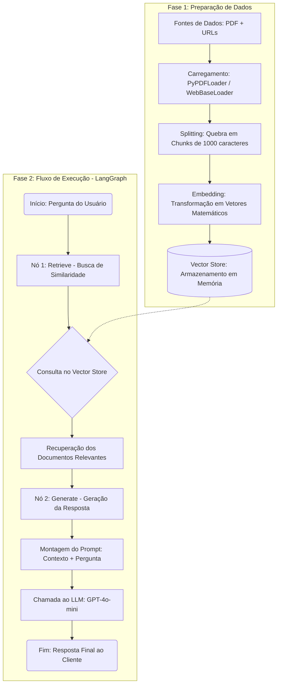

# Assistente de Recarga para Veículos Elétricos (GoodWe Challenge)

Este projeto consiste em um assistente de Inteligência Artificial especializado no suporte a clientes sobre o ecossistema de recarga de veículos elétricos (EV). Desenvolvido como parte de um desafio acadêmico em parceria com a GoodWe, o chatbot utiliza arquitetura RAG (Retrieval-Augmented Generation) para fornecer respostas precisas e fundamentadas.

## Integrantes

- Carlos Eduardo Affonso — RM 569676
- Gabriel Oliveira Gusmão Florencio dos Santos — RM 573747
- Gabrieli de Lima Pettena de Oliveira — RM 569799
- Igor Massone Monteiro — RM 573853
- Murilo Massahiro Kamei de Santi — RM 573046
- Temitope Kuku da Silva Ogunbanjo — RM 573772

## 📋 Problemática

A abordagem de expansão dos carregadores de veículos elétricos ao meio comercial é um processo essencial, tendo em vista a crescente demanda de veículos elétricos na sociedade atual. Baseado nisso, a adaptação dos carregadores tem que ser feita com um novo tipo de sistema em mente, que leve em consideração:

    Capacidade elétrica dos estabelecimentos.

    Interfaces intuitivas de interação com o cliente.

    Sistemas de pagamento integrados ao uso.

Para mitigar dúvidas de novos usuários sobre este sistema complexo, elaboramos uma IA que atua como um assistente técnico especializado.

## 🛠️ Tecnologias Utilizadas

Optamos pelo uso do modelo **OpenAI GPT-4o-mini** por ser um modelo rápido e econômico, com um nível de complexidade apropriado ao escopo do projeto. Também utilizaremos a tecnologia **OpenAI Embeddings**, que transforma textos em vetores matemáticos, permitindo que o modelo “entenda” o significado semântico das palavras. 

O framework **LangChain** será a espinha dorsal do projeto, proporcionando um ambiente de desenvolvimento centralizado utilizando a arquitetura **RAG** para garantir que as respostas sejam fundamentadas em documentos técnicos da GoodWe e normas brasileiras de mobilidade elétrica. O framework **LangGraph** também será utilizado com o intuito de definir um fluxo de trabalho bem definido para o modelo de IA. 

## 🏗️ Arquitetura do Sistema

O funcionamento do chatbot segue o fluxo definido abaixo, dividindo-se entre a preparação da base de conhecimento e o ciclo de resposta:

## 💬 Modelo de teste

Foi elaborado um modelo de teste com 5 perguntas e suas respostas esperadas:

**1º Pergunta:** A bateria do carro elétrico precisa estar completamente descarregada antes de carregá-lá?

**1º Resposta:** Não, a bateria do carro elétrico não precisa estar completamente descarregada antes de ser carregada. As baterias modernas de íons de lítio, como as usadas em carros elétricos, se beneficiam de recargas parciais. Portanto, você pode carregar o veículo sempre que desejar, mesmo que ainda haja carga na bateria.

**2º Pergunta:** Quais são os tipos de carregadores de carro elétrico?

**2º Resposta:** Os tipos de carregadores de carro elétrico incluem:

1. **Carregadores lentos (AC até 7,4 kW)** – Comumente utilizados em residências e estacionamentos.
2. **Carregadores semirrápidos (AC 11 a 22 kW)** – Encontrados em shoppings e empresas.
3. **Carregadores rápidos ou ultrarrápidos (DC 50 a 350 kW)** – Presentes nas rodovias e postos públicos.

Além disso, um exemplo específico de carregador é o WayBox 2.01, que oferece diferentes opções de potência de saída, com conectividade inteligente para monitoramento e agendamento de recargas através de um aplicativo.

**3º Pergunta:** Quanto custa uma recarga de um carro elétrico?

**3º Resposta:** O custo para recarregar um carro elétrico em um eletroposto varia entre R$ 1,50 e R$ 2,50 por kWh. Para um carro com uma bateria de 50 kWh, o custo total para uma carga completa seria de aproximadamente R$ 75 a R$ 125. Além disso, muitos eletropostos em shoppings e estacionamentos oferecem recarga gratuita como parte de programas de incentivo à mobilidade elétrica.

**4º Pergunta:** Quanto tempo demora para realizar uma recarga de um carro elétrico?

**4º Resposta:** O tempo para realizar uma recarga de um carro elétrico varia dependendo do tipo de carregador utilizado e da capacidade da bateria do veículo. Em média, aqui estão algumas estimativas de tempos de recarga:

1. **Carregadores lentos (AC 3,7 – 7,4 kW)**: levam de 4 a 16 horas para atingir cerca de 80% da bateria.
2. **Carregadores semirrápidos (AC 11 – 22 kW)**: podem levar de 1 a 4 horas.
3. **Carregadores rápidos (DC 50 kW)**: demoram cerca de 30 a 60 minutos para 80% de carga.
4. **Carregadores ultrarrápidos (DC 150 a 350 kW)**: conseguem alcançar 80% em apenas 10 a 30 minutos.

Portanto, dependendo da potência do carregador e do modelo do veículo, o tempo de recarga pode variar bastante, com uma média entre 20 a 60 minutos em eletropostos rápidos.

**5º Pergunta:** O carro elétrico pode ser recarregado debaixo de chuva?

**5º Resposta:** Sim, porque os pontos de recarga públicos e os dos próprios carros são feitos com materiais resistentes à água. Mesmo assim, é preciso tomar os mesmos cuidados em relação a qualquer outro equipamento elétrico, como evitar que a chuva caia diretamente sobre o conector ou a porta de recarga.

## ⚙️ Configuração do Contexto (System Prompt)

Para garantir que a IA não forneça respostas genéricas e mantenha o foco no escopo técnico, utilizamos o seguinte direcionamento:

Em Português:

    "Você é o ChargeGrid Intelligence, um assistente virtual especializado da GoodWe para soluções de recarga comercial de veículos elétricos (EV).
     Seu objetivo é responder perguntas de forma clara e concisa usando o contexto fornecido abaixo.
     Se você não souber a resposta ou se a informação não estiver no contexto, diga educadamente que não possui essa informação técnica no momento."

## Execução dos casos de teste

Segue-se abaixo o resultado da execução dos casos de teste:

**Pergunta 1:** A bateria do carro elétrico precisa estar completamente descarregada antes de carregá-lá?

**Resposta Obtida:** Não, você não precisa esperar que a bateria do seu veículo descarregue completamente antes de carregá-la. As novas baterias de íons de lítio se beneficiam de pequenas sessões de carregamento,
permitindo que você recarregue seu automóvel elétrico sempre que desejar.

**Avaliação:** Resposta adequada.

---

**Pergunta 2:** Quais são os tipos de carregadores de carro elétrico?

**Resposta Obtida:** Os tipos principais de carregadores de carro elétrico são:

1. **Carregadores lentos (AC até 7,4 kW)** – Usados em residências e estacionamentos.
2. **Carregadores semirrápidos (AC 11 a 22 kW)** – Encontrados em shoppings e empresas.
3. **Carregadores rápidos ou ultrarrápidos (DC 50 a 350 kW)** – Presentes nas rodovias e postos públicos.

**Avaliação:** Resposta adequada.

---

**Pergunta 3:** Quanto custa uma recarga de um carro elétrico?

**Resposta Obtida:**  O custo médio para recarregar um carro elétrico em um eletroposto varia entre R$ 1,50 e R$ 2,50 por kWh. Por exemplo, para um carro com bateria de 50 kWh,
o custo total para uma carga completa seria de aproximadamente R$ 75 a R$ 125. Além disso, muitos eletropostos em shoppings e estacionamentos oferecem recarga gratuita como parte de programas de incentivo à mobilidade elétrica.

**Avaliação:** Resposta adequada.

---

**Pergunta 4:** Quanto tempo demora para realizar uma recarga de um carro elétrico?

**Resposta Obtida:** O tempo de recarga de um carro elétrico varia conforme o tipo de carregador e o tamanho da bateria do veículo. Em média, o tempo para carregar até 80% é:

- Lento (AC 3,7 – 7,4 kW): 4 a 8 horas
- Semirrápido (AC 11 – 22 kW): 1 a 4 horas
- Rápido (DC 50 kW): 30 a 60 minutos
- Ultrarrápido (DC 150 a 350 kW): 10 a 30 minutos

Portanto, em média, para uma recarga em eletroposto, o tempo pode variar de 20 a 60 minutos, dependendo da potência do carregador e do modelo do veículo.

**Avaliação:** Resposta adequada.

---

**Pergunta 5:** O carro elétrico pode ser recarregado debaixo de chuva?

**Resposta obtida:** Sim, é seguro carregar um carro elétrico debaixo de chuva. As estações de carregamento e as tomadas são construídas de acordo com normas de segurança internacionais que garantem que o equipamento é à prova de água e seguro para manuseio em condições molhadas. Além disso, os sistemas elétricos dos veículos elétricos são meticulosamente selados para evitar a infiltração de humidade, minimizando os riscos de choques elétricos ou danos no veículo.

**Avaliação:** Resposta adequada.

## Instruções de execução

Recomendamos seguir o passo a passo para utilizar o assistente de IA desenvolvido.

1. Baixe o arquivo Sprint02_Prompt_IA.ipynb;
2. Abra o Google Colab;
3. Selecione a opção "Abrir notebook" e selecione o arquivo baixado
4. Execute todas as celulas na ordem em que estão

## Exemplos de uso

**Executando as células iniciais de configuração**

**Configurando o System Prompt**

