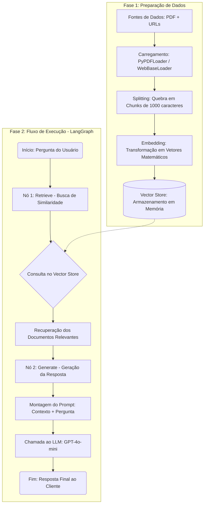

# Assistente de Recarga para Veículos Elétricos (GoodWe Challenge)

Este projeto consiste em um assistente de Inteligência Artificial especializado no suporte a clientes sobre o ecossistema de recarga de veículos elétricos (EV). Desenvolvido como parte de um desafio acadêmico em parceria com a GoodWe, o chatbot utiliza arquitetura RAG (Retrieval-Augmented Generation) para fornecer respostas precisas e fundamentadas.

## Integrantes

- Carlos Eduardo Affonso — RM 569676
- Gabriel Oliveira Gusmão Florencio dos Santos — RM 573747
- Gabrieli de Lima Pettena de Oliveira — RM 569799
- Igor Massone Monteiro — RM 573853
- Murilo Massahiro Kamei de Santi — RM 573046
- Temitope Kuku da Silva Ogunbanjo — RM 573772

## 📋 Problemática

A abordagem de expansão dos carregadores de veículos elétricos ao meio comercial é um processo essencial, tendo em vista a crescente demanda de veículos elétricos na sociedade atual. Baseado nisso, a adaptação dos carregadores tem que ser feita com um novo tipo de sistema em mente, que leve em consideração:

    Capacidade elétrica dos estabelecimentos.

    Interfaces intuitivas de interação com o cliente.

    Sistemas de pagamento integrados ao uso.

Para mitigar dúvidas de novos usuários sobre este sistema complexo, elaboramos uma IA que atua como um assistente técnico especializado.

## 🛠️ Tecnologias Utilizadas

Optamos pelo uso do modelo **OpenAI GPT-4o-mini** por ser um modelo rápido e econômico, com um nível de complexidade apropriado ao escopo do projeto. Também utilizaremos a tecnologia **OpenAI Embeddings**, que transforma textos em vetores matemáticos, permitindo que o modelo “entenda” o significado semântico das palavras. 

O framework **LangChain** será a espinha dorsal do projeto, proporcionando um ambiente de desenvolvimento centralizado utilizando a arquitetura **RAG** para garantir que as respostas sejam fundamentadas em documentos técnicos da GoodWe e normas brasileiras de mobilidade elétrica. O framework **LangGraph** também será utilizado com o intuito de definir um fluxo de trabalho bem definido para o modelo de IA. 

## 🏗️ Arquitetura do Sistema

O funcionamento do chatbot segue o fluxo definido abaixo, dividindo-se entre a preparação da base de conhecimento e o ciclo de resposta:

## 💬 Exemplos de Interação (Q&A)

O assistente foi validado com as seguintes questões fundamentais:

**Pergunta:** A bateria do carro elétrico precisa estar completamente descarregada antes de carregá-lá?

**Resposta:** Não, a bateria do carro elétrico não precisa estar completamente descarregada antes de ser carregada. As baterias modernas de íons de lítio, como as usadas em carros elétricos, se beneficiam de recargas parciais. Portanto, você pode carregar o veículo sempre que desejar, mesmo que ainda haja carga na bateria.

**Pergunta:** Quais são os tipos de carregadores de carro elétrico?

**Resposta:** Os tipos de carregadores de carro elétrico incluem:

1. **Carregadores lentos (AC até 7,4 kW)** – Comumente utilizados em residências e estacionamentos.
2. **Carregadores semirrápidos (AC 11 a 22 kW)** – Encontrados em shoppings e empresas.
3. **Carregadores rápidos ou ultrarrápidos (DC 50 a 350 kW)** – Presentes nas rodovias e postos públicos.

Além disso, um exemplo específico de carregador é o WayBox 2.01, que oferece diferentes opções de potência de saída, com conectividade inteligente para monitoramento e agendamento de recargas através de um aplicativo.

**Pergunta:** Quanto custa uma recarga de um carro elétrico?

**Resposta:** O custo para recarregar um carro elétrico em um eletroposto varia entre R$ 1,50 e R$ 2,50 por kWh. Para um carro com uma bateria de 50 kWh, o custo total para uma carga completa seria de aproximadamente R$ 75 a R$ 125. Além disso, muitos eletropostos em shoppings e estacionamentos oferecem recarga gratuita como parte de programas de incentivo à mobilidade elétrica.

## ⚙️ Configuração do Contexto (System Prompt)

Para garantir que a IA não forneça respostas genéricas e mantenha o foco no escopo técnico, utilizamos o seguinte direcionamento:

Em Português:

    "Você é um assistente especializado em responder perguntas sobre veículos elétricos, carregadores de veículos elétricos e o processo de recarga. Responda as perguntas de forma clara e objetiva usando o contexto obtido."

No Código (Inglês):

    "You are an assistant specialized in answering questions about electric vehicles, electric vehicle chargers, and the charging process. Answer questions clearly and concisely using the context provided."
